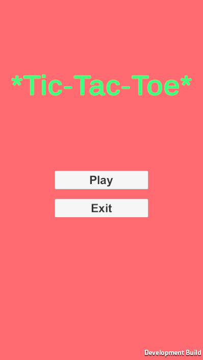
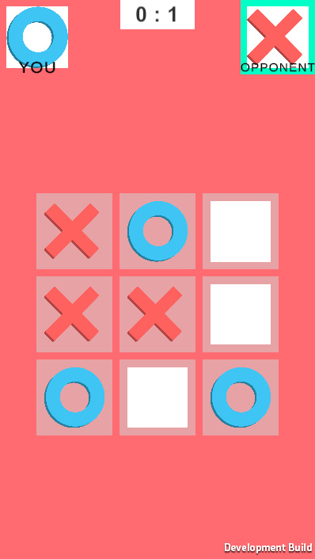

# 🎮 Tic-Tac-Toe Client (Unity)

This is the **client-side** implementation of an online two-player Tic-Tac-Toe game built using **Unity 2022.1.24f1**. It communicates in real-time with a Node.js server via **Socket.IO**, using a C# wrapper for Unity.

> 🧪 This project was created as a learning experiment for real-time multiplayer game development in Unity.

---

## 🚀 Features

- 🎯 Online multiplayer (2 players)
- ⚡ Real-time communication via Socket.IO
- 🎲 Turn-based logic with win/draw detection
- 🖥️ Simple and clean UI for fast gameplay
- 🧩 Modular and maintainable code structure

---

## 🔌 Technologies & Tools

- **Unity 2022.1.24f1**
- **C#**
- **[SocketIOUnity](https://github.com/itisnajim/SocketIOUnity)** (Socket.IO client for Unity)
- **Node.js server** (see [server repo](https://github.com/Pixel0Void/tic-tac-toe-server))

---

## 📦 Project Structure

```
Assets/
├── Scripts/
│   ├── NetworkManager.cs      # Handles socket connection
│   ├── GameManager.cs         # Game flow logic
│   ├── UIManager.cs           # UI updates and interactions
│   └── Models/                # Data classes (Game State, Move, etc.)
├── Prefabs/
├── Scenes/
│   └── GameScene.unity
└── Plugins/
    └── SocketIOUnity/
```

---

## 🧪 Getting Started

### Prerequisites

- [Unity Hub](https://unity.com/)
- Unity 2022.1.24f1 installed

### Setup Instructions

1. Clone the repository:
   ```bash
   git clone https://github.com/Pixel0Void/tic-tac-toe-client.git
   ```
2. Open the project in Unity.
3. Make sure your backend server is running ([server repo](https://github.com/Pixel0Void/tic-tac-toe-server)).
4. Play the scene and enjoy the game with another player!

---

## 📷 Screenshots

<p align="center">
  
  
</p>

---

Made with ❤️ using Unity.
